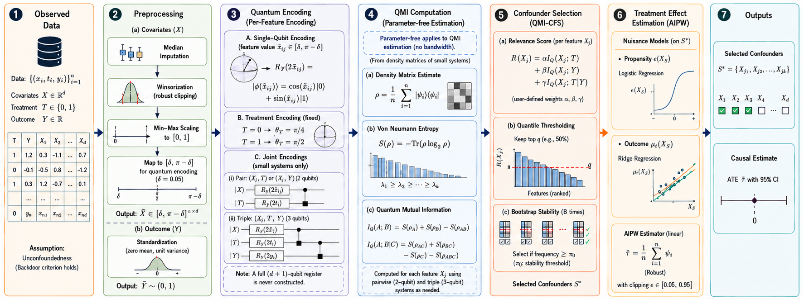
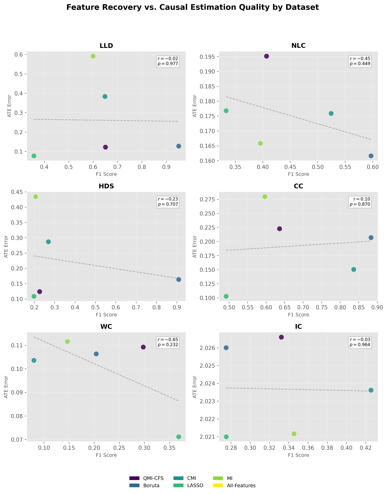
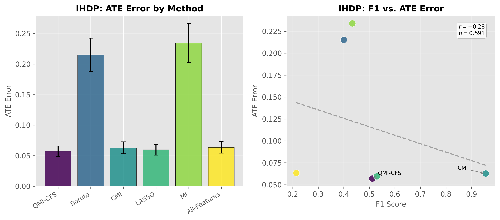

# QMI-CFS: Quantum Mutual Information for Causal Feature Selection

[](https://www.python.org/downloads/)
[](LICENSE)
[](paper/paper.tex)

> **An empirical study of feature recovery and treatment effect estimation using quantum-inspired dependency measures.**

---

## ✨ Highlights

- **Quantum-inspired, classical implementation** — no quantum hardware needed.
- **Parameter-free QMI estimation** — no bandwidth or neighbor-count tuning unlike k-NN MI.
- **Competitive confounder recovery** — compared against MI, CMI, LASSO, Boruta, and All-Features.
- **Striking divergence finding** — confounder-recovery F1 and downstream ATE error are essentially uncorrelated across benchmarks.
- **Reproducible** — all tables, figures, and statistics can be regenerated from the saved CSVs in one command.

---

## 📄 Manuscript

This repository accompanies the manuscript:

> **Quantum Mutual Information for Causal Feature Selection: An Empirical Study of Feature Recovery and Treatment Effect Estimation**

Submitted to the **International Conference on ICTer 2026** — currently under review.

The LaTeX source is in [`paper/`](paper/) and is ready for Overleaf upload.

---

## 🚀 What is QMI-CFS?

**QMI-CFS** encodes classical covariates into quantum states via angle embedding, constructs small single-, pair-, and triple-qubit density matrices, and computes **Quantum Mutual Information (QMI)** from their von Neumann entropies. Features are scored by a composite relevance function that balances:

- propensity relevance: `QMI(X; T)`
- prognostic relevance: `QMI(X; Y)`
- conditional relevance: `QMI(X; T | Y)` (helps distinguish confounders from instruments)

Selected features are fed into a doubly-robust AIPW estimator for the Average Treatment Effect (ATE).

<p align="center">
  
</p>

---

## 📁 Repository Structure

```text
qmi_cfs_project/
├── qmi_cfs/              # Core Python package
├── scripts/              # Experiment runners & paper-asset generators
├── tests/                # Integration tests
├── results/              # Final experimental CSVs
├── paper/                # Springer SVProc manuscript source
│   ├── paper.tex
│   ├── svproc.cls
│   ├── figures/          # Final paper figures
│   └── tables/           # Generated LaTeX tables
├── README.md
├── LICENSE
├── requirements.txt
└── setup.py
```

---

## 🛠️ Installation

```bash
cd qmi_cfs_project
pip install -e .
```

For the optional Boruta baseline:

```bash
pip install -e ".[boruta]"
```

### Requirements

- Python ≥ 3.9
- NumPy, SciPy, scikit-learn, pandas, matplotlib, statsmodels
- BorutaPy, tqdm

See [`requirements.txt`](requirements.txt) for pinned versions.

---

## 🔬 Reproducing the Paper

### 1. Run the experiments

You can either use the precomputed CSVs in [`results/`](results/) or regenerate them:

```bash
# Feature-selection accuracy
python scripts/run_experiment1.py --seeds 50 --output results/experiment1

# Treatment-effect estimation
python scripts/run_experiment2.py --seeds 30 --output results/experiment2

# Small-sample analysis
python scripts/run_experiment3.py --seeds 50 --output results/experiment3

# IHDP benchmark
python scripts/run_ihdp_experiment.py --seeds 50 --output results/ihdp

# Ablation study
python scripts/run_ablation_study.py --output results/ablation
```

### 2. Generate tables and figures

```bash
# LaTeX tables
python scripts/generate_tables.py --output paper/tables

# Main figures
python scripts/generate_figures.py --output paper/figures
python scripts/generate_ic_figure.py --output paper/figures
```

Or regenerate all figures directly from the CSVs:

```bash
python scripts/regenerate_paper_figures.py
```

### 3. Compile the paper

Upload the entire [`paper/`](paper/) folder to Overleaf and compile with **pdfLaTeX**.

---

## 📊 Key Results

### Divergence between feature recovery and causal estimation

Across the six synthetic DGPs, F1 score explains only about **4%** of the variance in ATE error, and the correlation is not statistically significant.

<p align="center">
  
</p>

### IHDP benchmark

On IHDP Setting A, QMI-CFS achieves the **lowest ATE error** despite only moderate F1, demonstrating that a feature set with lower recovery accuracy can still yield better causal estimates when it is well-calibrated for the downstream nuisance models.

<p align="center">
  
</p>

### Interacting confounders

When confounders enter only through multiplicative interactions, all dependency-based selectors — including QMI-CFS — struggle, even with pairwise augmentation and nonlinear AIPW.

---

## ✅ Tests

```bash
pytest tests/ -q
```

The integration tests verify that the core pipeline (data generation → QMI selection → AIPW estimation) runs end-to-end without errors.

---

## 🤝 Contributing

This repository was produced for a research manuscript. If you use or extend QMI-CFS, please consider opening an issue or pull request with improvements, additional baselines, or bug fixes.

---

## 📚 Citation

If you use this code or the QMI-CFS method in your research, please cite the paper once it is accepted and published. Until then, you can reference the manuscript as:

```bibtex
@unpublished{qmi_cfs_2026,
  title={Quantum Mutual Information for Causal Feature Selection: An Empirical Study of Feature Recovery and Treatment Effect Estimation},
  author={Anonymous Research Team},
  note={Submitted to the International Conference on ICTer 2026, under review},
  year={2026}
}
```

> Replace the placeholder author line with the final paper metadata once available.

---

## 📝 License

This project is licensed under the [MIT License](LICENSE).

---

<p align="center">
  <i>Built with ❤️ for reproducible causal machine learning research.</i>
</p>
